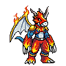
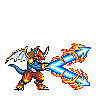

<p align="center">
  
</p>

<h1 align="center">Digigotchi</h1>
<p align="center"><strong>Virtual Pet inspirado em Digimon, com evolução, treino, sprites animados, sons e habilidades.</strong></p>

<p align="center">
  <code>React 19</code> · <code>Vite 8</code> · <code>TanStack Start</code> · <code>Tailwind CSS 4</code> · <code>Zustand</code> · <code>Docker</code>
</p>

---

## ✨ Sobre o projeto

**Digigotchi** é um projeto de fã focado em criar a sensação de cuidar de um parceiro digital: alimentar, brincar, dormir, limpar, curar, treinar, evoluir e acompanhar diferentes linhas de Digimon.

Nesta versão, o projeto já inclui linhas de **Agumon, Etemon, Gabumon e Veemon**, com formas evoluídas como **GeoGreymon, WarGreymon, MetalEtemon, Garurumon, WereGarurumon, Flamedramon e XV-mon / ExVeemon**.

O projeto também possui:

- animações por ação usando sequências de sprites;
- sprites refinados em múltiplas rodadas;
- escala individual por espécie;
- sistema de sono acelerado para QA;
- treino com habilidades específicas por Digimon;
- áudio por ação;
- efeitos visuais de ataques;
- interface inspirada na experiência de uma **tela inferior de Nintendo DS**;
- pipeline em Python para tratamento e geração de sprites;
- Docker para ambiente de desenvolvimento reproduzível.

---

## 🐉 XV-mon / ExVeemon

<p align="center">
  
</p>

O conjunto atual de **XV-mon** foi totalmente substituído na **Rodada 3** usando a nova folha enviada ao projeto. Os frames estão organizados em:

```text
public/sprites/animated/xvmon/
├── idle/
├── eat/
├── play/
├── sleep/
├── wake/
├── clean/
├── heal/
├── evolve/
└── attack-vee-laser/
```

A imagem original usada como referência nesta rodada está preservada em:

```text
attachments/user_sprite_sheets_round3/
```

---

# 🚀 Como rodar o projeto

## Opção recomendada — Docker + WSL2

### Pré-requisitos

- Docker Desktop
- WSL2 / Ubuntu
- Docker Compose

### 1. Entre na pasta do projeto

```bash
cd Digigotchi-main
```

### 2. Derrube containers e volumes antigos

Especialmente útil depois de trocar versão do projeto ou dependências:

```bash
docker compose down -v --remove-orphans
```

### 3. Faça o build da imagem

```bash
docker compose build --no-cache
```

### 4. Suba o projeto

```bash
docker compose up
```

O Vite deve mostrar algo semelhante a:

```text
VITE ready
Local:   http://localhost:8080/
Network: http://172.x.x.x:8080/
```

### 5. Abra no navegador

Tente primeiro:

```text
http://localhost:8080
```

Se no Windows o `localhost` ficar carregando indefinidamente, use o IP do WSL:

```bash
hostname -I
```

Exemplo:

```text
172.25.32.150
```

Então abra:

```text
http://172.25.32.150:8080
```

> No ambiente de desenvolvimento deste projeto, acessar pelo **IP do WSL** pode funcionar melhor que o encaminhamento automático de `localhost` do Windows.

---

## 🔍 Testar se o servidor está vivo dentro do container

```bash
docker exec -it digigotchi-dev wget -S -O - http://127.0.0.1:8080/
```

Se estiver funcionando, você verá:

```text
HTTP/1.1 200
```

Para conferir as portas publicadas:

```bash
docker port digigotchi-dev
```

Esperado:

```text
8080/tcp -> 0.0.0.0:8080
```

---

# 💻 Rodar sem Docker

## Recomendação

Use **Node.js 22**.

### Instalar dependências

```bash
npm install
```

### Desenvolvimento

```bash
npm run dev
```

Servidor padrão:

```text
http://localhost:8080
```

---

# 🏗️ Como buildar

## Build de produção

```bash
npm run build
```

O script configurado no `package.json` executa:

```text
vite build
+
db:migrate
```

Para conferir somente o build em modo development:

```bash
npm run build:dev
```

## Verificação de TypeScript

```bash
npm run typecheck
```

## Testes

```bash
npm test
```

## Lint

```bash
npm run lint
```

## Formatação

```bash
npm run format
```

---

# 🐳 Dockerfile atual

O ambiente Docker utiliza:

```dockerfile
FROM node:22-alpine
```

As dependências são instaladas com:

```dockerfile
RUN npm install --no-audit --no-fund
```

Isso é intencional: uma versão anterior do projeto possuía um `package-lock.json` fora de sincronia com o `package.json`, causando erro no `npm ci`.

A aplicação é exposta na porta:

```text
8080
```

---

# 🎮 Estrutura principal

```text
Digigotchi-main/
├── src/
│   ├── components/game/
│   │   ├── StartScreen.tsx
│   │   ├── ChooseScreen.tsx
│   │   └── PlayScreen.tsx
│   └── lib/pet/
│       ├── data.ts
│       ├── engine.ts
│       └── store.ts
│
├── public/
│   ├── sprites/
│   │   ├── animated/
│   │   └── keyframes/
│   ├── sprite-sheets/
│   ├── fx/
│   └── audio/digimon/
│
├── scripts/
│   ├── build_sprite_pipeline.py
│   ├── refine_sprite_actions.py
│   ├── apply_round2_sprite_update.py
│   ├── apply_round3_xvmon_replacement.py
│   ├── qa_refinement.py
│   └── generate_digimon_audio.py
│
├── attachments/
│   ├── user_sprite_sheets_round2/
│   ├── user_sprite_sheets_round3/
│   └── round3_previews/
│
├── Dockerfile
├── docker-compose.yml
└── package.json
```

---

# ⚔️ Habilidades atuais

O projeto associa ao menos uma habilidade de treino/ataque a cada forma atual:

| Digimon | Habilidade usada no projeto |
|---|---|
| Agumon | Pepper Breath |
| GeoGreymon | Mega Flame |
| WarGreymon | Terra Force |
| Etemon | Love Serenade |
| MetalEtemon | Banana Slip |
| Gabumon | Blue Blaster |
| Garurumon | Howling Blaster |
| WereGarurumon | Wolf Claw |
| Veemon | Vee Headbutt |
| Flamedramon | Fire Rocket |
| XV-mon / ExVeemon | Vee Laser |

> Os nomes de golpes podem variar entre versões japonesas, localizações, jogos, anime e outros materiais da franquia.

---

# 🎨 Sprites e referências visuais

O material visual do projeto foi construído e refinado a partir de várias folhas de sprites fornecidas durante o desenvolvimento, além de novas sheets criadas especificamente para as rodadas de melhoria.

## Jogos e dispositivos usados como referência de sprite

Os nomes dos arquivos-fonte preservados no projeto apontam para referências de:

### Game Boy Advance

- **Digimon Battle Spirit**
  - Agumon
  - WarGreymon
  - Gabumon
  - Etemon

### Nintendo DS / DSi

- **Digimon World DS**
  - Flamedramon
  - MetalEtemon

### WonderSwan / WonderSwan Color

- **Digimon Adventure 02: Digital Partner**
  - Garurumon
  - WereGarurumon

- **Digimon Tamers: Battle Spirit Ver. 1.5**
  - Veemon

### Vital Bracelet BE

- **BEM#0128: Imperialdramon BE**
  - XV-mon

- **BEM#0129: Dragonic Blaze**
  - GeoGreymon

## Novas sprite sheets produzidas durante o projeto

Também foram usadas folhas adicionais enviadas especificamente para o refinamento de:

- Agumon
- GeoGreymon
- WarGreymon
- Etemon
- MetalEtemon
- Gabumon
- Garurumon
- WereGarurumon
- Veemon
- Flamedramon
- XV-mon / ExVeemon

Essas referências estão preservadas principalmente em:

```text
attachments/user_sprite_sheets_round2/
attachments/user_sprite_sheets_round3/
```

---

# 📚 Referências de Digimon

Para nomes, designs, espécies, golpes e conferência de nomenclaturas, o desenvolvimento utilizou como referência principalmente:

### Fontes oficiais

- **Digimon Web / Digimon Encyclopedia / Digimon Reference Book**  
  https://digimon.net/reference_en/

- **Digimon Web — portal oficial**  
  https://digimon.net/

### Fontes comunitárias usadas como apoio e comparação

- **Wikimon**  
  https://wikimon.net/

- **Digimon Wiki**  
  https://digimon.fandom.com/

Essas fontes comunitárias foram usadas como apoio especialmente quando nomes de ataques e romanizações variavam entre mídia japonesa e localização internacional.

---

# 🕹️ Inspirações de design

O projeto possui inspiração visual e de experiência em:

- **Digimon World** — conceito de parceiro digital e cuidado;
- jogos da franquia Digimon no **Nintendo DS**;
- a organização de menus e molduras da **tela inferior do Nintendo DS**;
- virtual pets clássicos;
- pixel art de jogos de GBA, DS e WonderSwan.

A interface atual usa essa linguagem apenas como **inspiração visual**, sem copiar a interface original de um jogo específico.

---

# 🧰 Referências técnicas

Tecnologias principais utilizadas:

- React — https://react.dev/
- Vite — https://vite.dev/
- TanStack Start / Router — https://tanstack.com/
- Tailwind CSS — https://tailwindcss.com/
- Zustand — https://zustand.docs.pmnd.rs/
- Lucide — https://lucide.dev/
- TypeScript — https://www.typescriptlang.org/
- Docker — https://docs.docker.com/

A lista completa das bibliotecas instaladas está no arquivo:

```text
package.json
```

---

# 🧪 Pipeline visual

Para reconstruir/refinar os sprites existentes:

```bash
python3 scripts/build_sprite_pipeline.py
```

QA dos assets:

```bash
python3 scripts/qa_refinement.py
```

Scripts específicos das rodadas mais recentes:

```bash
python3 scripts/apply_round2_sprite_update.py
python3 scripts/apply_round3_xvmon_replacement.py
```

> Esses scripts dependem dos arquivos-fonte específicos usados durante cada rodada. Para uma nova máquina, mantenha as pastas `attachments/` preservadas.

---

# ❤️ Agradecimentos

Este projeto só chegou ao estado atual graças a muitas referências, testes e iterações.

Agradecimentos especiais:

- aos criadores e equipes responsáveis pela franquia **Digimon**;
- às equipes de desenvolvimento dos jogos que serviram como referência visual;
- às comunidades que documentam cuidadosamente espécies, ataques, nomes e aparições dos Digimon;
- a quem preserva e cataloga pixel art e sprite sheets de jogos antigos;
- a todos que contribuíram com testes, novas sheets, ideias de animação e refinamento visual;
- e principalmente a quem continua construindo, quebrando, testando e melhorando este projeto a cada rodada. 💙

<p align="center">
  
</p>

<p align="center"><strong>Obrigado por jogar, testar e ajudar o Digigotchi a evoluir.</strong></p>

---

# ⚖️ Aviso sobre propriedade intelectual

**Digigotchi é um projeto de fã e não é afiliado oficialmente à Bandai, Toei Animation ou aos demais detentores de direitos relacionados à franquia Digimon.**

Digimon, nomes de personagens, designs, nomes de ataques e demais elementos da franquia pertencem aos seus respectivos detentores de direitos.

Os assets usados neste repositório devem ser tratados de acordo com os direitos aplicáveis antes de qualquer publicação, distribuição comercial ou monetização.

---

## 📌 Estado atual

O projeto está em desenvolvimento ativo. Algumas animações, efeitos, sons, escalas e sprite sheets continuam em processo de refinamento.

A regra para as próximas rodadas é simples:

> **cada evolução precisa parecer melhor que a anterior — tanto no jogo quanto no código.**

